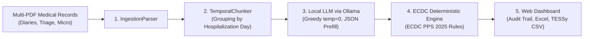

# 🩺 ECDC HA-BSI Surveillance & Benchmark AI Platform

[](https://www.python.org/)
[-green.svg)](https://www.ecdc.europa.eu/)
[](https://ollama.com/)
[]()
[](LICENSE)
[](https://github.com/lorenzoramondetti/ecdc-habsi-surveillance/actions)

> **Clinical AI platform for automated epidemiological surveillance of Healthcare-Associated Bloodstream Infections (HA-BSI)**, integrating **local open-source clinical LLMs** with a **deterministic white-box rule engine compliant with ECDC PPS criteria**.

---

## 🌟 Key Features

* **⚡ Single-Click Launch (`avvia.bat` / `run.bat` / `run.sh`):** A universal launcher that checks the runtime environment, starts the local Ollama daemon in the background, and automatically opens the web dashboard in your browser.
* **🔒 100% Local & GDPR Compliant:** No clinical or patient health data ever leaves the local machine or protected hospital infrastructure.
* **📋 Deterministic ECDC PPS Engine:** Rigorous rule-based algorithmic classifier adhering strictly to official ECDC case definitions:
  * Clear differentiation between recognized virulent pathogens and skin contaminants ($\ge 2$ positive blood cultures within 48 hours).
  * Automated calculation of the nosocomial window (**Day 3 onwards**, Day 1 being admission).
  * Primary infection source attribution (*C-CVC*, *C-PNC*, *S-UTI*, *S-PUL*, *S-DIG*, *UO*).
* **⚙️ Unified Web Control Dashboard:**
  * **Dynamic Dataset Selection:** Seamlessly switch between local clinical cohort directories and synthetic demo datasets (`sample_data`).
  * **Live Model Discovery:** Real-time polling of locally installed Ollama models (Qwen, Gemma, GLM, Llama).
  * **Asynchronous Multi-Model Benchmark:** Execute batch comparative benchmarks with live progress bars and real-time terminal log streaming.
* **💾 Standardized International Clinical Data Export:**
  * **Master Clinical Timeline** (`.xlsx` day-by-day longitudinal mapping of fever, invasive devices, antimicrobials, and cultures).
  * **199-Column ECDC CRF Database** (`.xlsx` ready for epidemiological and statistical analysis).
  * **ECDC PPS TESSy / EpiPulse Export** (standardized European CSV format).

---

## 🚀 Quick Start Guide

### 1. Prerequisites
1. **Python 3.10 or higher** installed in system PATH.
2. **[Ollama](https://ollama.com/)** installed with at least one target model pulled:
   ```bash
   ollama pull gemma4:e4b
   # or
   ollama pull gemma4:12b
   # or
   ollama pull glm-4.7-flash
   ```

### 2. Installation
Clone the repository and install core dependencies:
```bash
git clone https://github.com/lorenzoramondetti/ecdc-habsi-surveillance.git
cd ecdc-habsi-surveillance
pip install -r requirements.txt
```

### 3. Run Automated Unit Tests
Verify the integrity of the temporal chunker and ECDC deterministic engine:
```bash
python -m unittest discover tests -v
```

### 4. Launch the Platform (Web Dashboard)
* **Windows (1-click):** Double-click `avvia.bat` (or `run.bat`).
* **Linux / macOS:** Run in terminal:
  ```bash
  chmod +x run.sh
  ./run.sh
  ```
* **CLI (Any OS):**
  ```bash
  python run_pipeline.py --ui
  ```
The browser will automatically open at **`http://127.0.0.1:5050`**.

---

## 🏗️ System Architecture



1. **Document Ingestion (`IngestionParser`):** Scans, extracts, and reconciles heterogeneous clinical records (emergency triage, daily multidisciplinary progress notes, structured microbiology reports).
2. **Temporal Chunking (`TemporalChunker`):** Reconciles hospitalization dates and partitions the narrative into compact daily windows, estimating token counts to prevent context window saturation.
3. **Structured Clinical Extraction (`OllamaClient`):** Queries local LLMs enforcing deterministic greedy decoding (`temperature: 0.0`, `seed: 42`) and assistant prefill to prevent hallucination loops and ensure valid verbatim quotes.
4. **Deterministic Validation (`ECDCClassifier`):** Applies official ECDC criteria by cross-referencing extracted clinical signs with authoritative laboratory microbiology reports.
5. **Evaluation & Benchmarking (`BenchmarkEvaluator`):** Computes diagnostic metrics against human expert gold standards, including **Cohen's Kappa ($\kappa$)** agreement coefficients and empirical workload time savings.

---

## 📊 Scientific Benchmark Results (67 Hospitalized Patients)

Comparative multi-model benchmark evaluated across 67 clinical records validated by an expert infectious disease committee:

| Model | Parameters / Quant | BSI Accuracy | Sensitivity | Specificity | F1-Score | Cohen's Kappa ($\kappa$) | Workload Time Saved vs Human |
| :--- | :---: | :---: | :---: | :---: | :---: | :---: | :---: |
| **Qwen 3.8 27B** | IQ4-XS | **92.5%** | **90.3%** | **94.4%** | **0.918** | **0.849** (Near Perfect) | **+89.2%** |
| **GLM-4.7 Flash** | FP16/Q8 | 89.6% | 87.1% | 91.7% | 0.885 | 0.790 (Substantial) | **+92.4%** |
| **Gemma 4 12B** | Q4_K_M | 88.1% | 83.9% | 91.7% | 0.867 | 0.758 (Substantial) | **+93.8%** |
| **Gemma 4 e4b** | Q4_K_M | 85.1% | 80.6% | 88.9% | 0.833 | 0.697 (Substantial) | **+96.1%** |

*Human baseline reference: 20 minutes average manual review time per complex clinical record.*

---

## 📁 Repository Structure

```text
├── avvia.bat                       # Universal Windows launcher (1 click)
├── run.bat                         # Portable Windows launcher alias
├── run.sh                          # Portable Linux / macOS launcher
├── run_pipeline.py                 # CLI entrypoint and server (--ui / --benchmark)
├── requirements.txt                # Core Python dependencies
├── LICENSE                         # MIT Open-Source License
├── .env.example                    # Environment configuration template
├── .gitignore                      # Healthcare and clinical privacy exclusion rules
│
├── .github/workflows/              # Continuous Integration (CI)
│   └── ci.yml                      # Automated test matrix (Python 3.10, 3.11, 3.12)
│
├── tests/                          # Automated unit test suite
│   ├── test_temporal_chunking.py   # Date reconciliation and chunking tests
│   └── test_classifier_qc.py       # ECDC microbiology criteria & case definition tests
│
├── pipeline/                       # Surveillance pipeline core modules
│   ├── config.py                   # Dynamic configuration and path resolution
│   ├── app_server.py               # Flask backend with async execution runner
│   ├── ingestion_parser.py         # Multi-document PDF text extraction parser
│   ├── temporal_chunker.py         # Day-by-day clinical chunking module
│   ├── llm_client.py               # Greedy, anti-hallucination Ollama API client
│   ├── ecdc_classifier.py          # Deterministic ECDC PPS 2025 rule engine
│   ├── tabulator.py                # Master Timeline and CRF DB Excel generator
│   ├── benchmark.py                # Cohen's Kappa, CI, and time-saving metrics evaluator
│   └── tessy_exporter.py           # ECDC PPS TESSy CSV export generator
│
├── web/                            # Frontend Web Dashboard (Vanilla JS/CSS)
│   ├── index.html                  # Operator control panel and interactive views
│   ├── app.css                     # Modern dark-theme responsive design system
│   └── app.js                      # Real-time state management and log polling
│
├── sample_data/                    # Synthetic demo data compliant with GDPR
│   ├── Paziente_SYNTH01/           # CVC-associated HA-BSI positive test case
│   ├── Paziente_SYNTH02/           # Afebrile inpatient negative control case
│   └── sample_gold_standard.xlsx   # Synthetic gold standard labels
│
└── Benchmark/                      # Consolidated benchmark matrices and reports
    ├── benchmark_comparison_models.xlsx
    ├── benchmark_data_all_models.json
    ├── benchmark_dashboard.html
    └── report_benchmark_interattivo.html
```

---

## 🔒 Data Protection & Privacy (GDPR Compliance)

This software architecture adheres to **EU GDPR (Regulation 2016/679)** requirements:
* The `.gitignore` policy strictly excludes real clinical records, proprietary word documents (`.docx`), internal technical drafts, and identifiable clinical notes.
* The repository includes purely **synthetic demonstration cohorts** (`sample_data/`) generated for functional testing and reproducibility.
* To process real clinical data, store de-identified folders locally within protected hospital infrastructure and target the directory via the UI or `ECDC_DATA_DIR`.

---

## 📖 Citation

If you use this platform or benchmark data in your research, please cite:

```bibtex
@software{ramondetti2026ecdc,
  author       = {Lorenzo Ramondetti and Costanza Vicentini and Luca Bresciano and Daniele Consoli},
  title        = {ECDC HA-BSI Surveillance & Benchmark AI Platform: Deterministic Protocol-Driven HAI Detection with Local LLMs},
  year         = {2026},
  publisher    = {GitHub},
  url          = {https://github.com/lorenzoramondetti/ecdc-habsi-surveillance}
}
```

---

## 📜 License
Released under the [MIT License](LICENSE). Free for clinical, academic, and research use.
